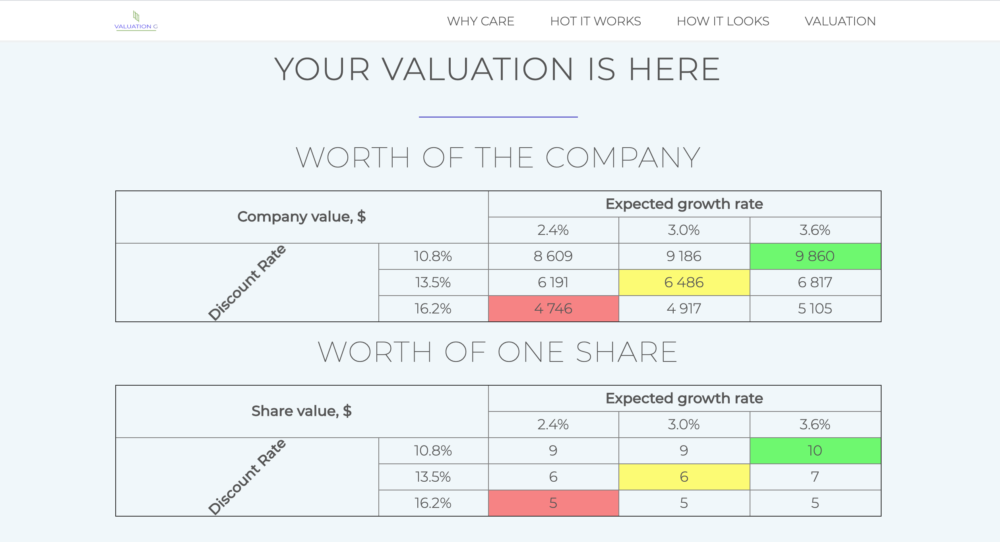

Веб-приложение, при помощи которого можно провести анализ стоиомости компании в рамках доходного подхода - методом дисконтированных денежных потоков. От пользователя требуется ввести исходные данные по ставке CAPM/WACC, GR, DCF(1-5), после чего происходит оценка стоимости с применением чувствительности как по ожидаемым ставкам постерминального прироста бизнеса, так и по ставке дисконтирования, в результате чего получается диапазон стоимости как всей компании, так и одной акции.

